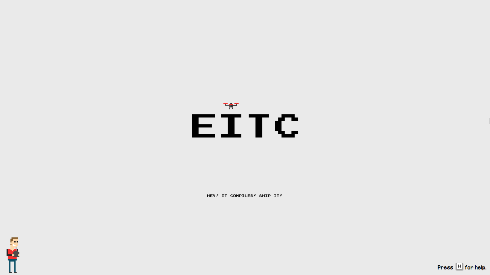

# drone
speed run moving drone with p5.js don't mind the spaghetti OOP :D

# Setup

Just host the page on localhost using your prefered method.
for example

```sh
$ git clone https://github.com/protozeit/drone.git
$ cd drone
$ php -S 127.0.0.1:8000
```

# Screenshots

